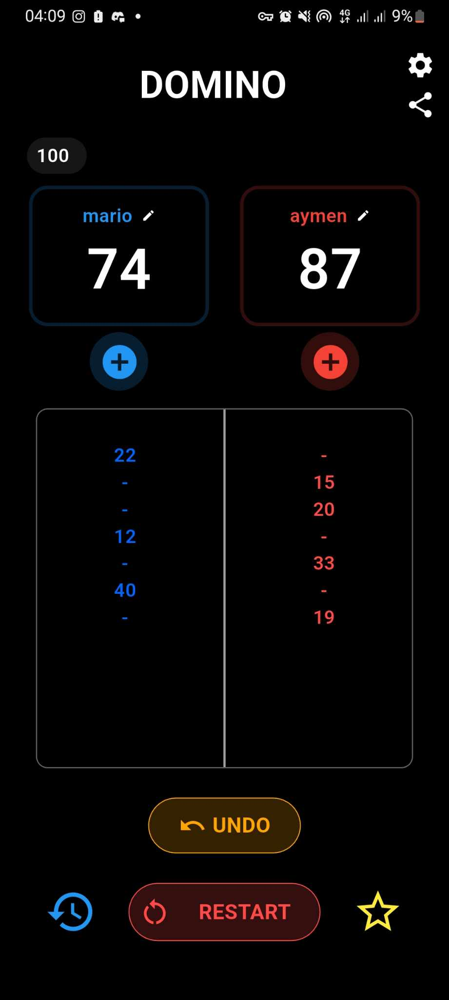

# Dominos Notebook

A simple Flutter app to keep track of team scores while playing Dominos.

## Features

- Edit team names
- Add points
- Reset scores
- Data saved locally using Hive

## Tech Stack

- Flutter
- Hive for local storage

## Getting Started

```bash
git clone https://github.com/yourusername/dominos-notebook-app.git
cd dominos-notebook-app
flutter pub get
flutter run
```

## Project Structure 
```
lib/
├── core/
├── features/
│   ├── home_screen/
│   │   ├── logic/
│   │   └── presentation/
│   └── history_screen/
│       ├── logic/
│       └── presentation/
├── shared/
│   └── models/
│── main.dart
```


## Screenshots

### Home Screen


### History Screen


## Download
You can download the app from the following link:

[Download Domino's Notebook](https://www.mediafire.com/file/ztct5fq8da75hnc/app-arm64-v8a-release%25282%2529.apk/file)

## Licence

Copyright (c) 2025 Benferhat Aymen

Permission is granted to use, copy, modify, and distribute this software for any purpose with or without fee.

The software is provided "as is", without warranty of any kind.
